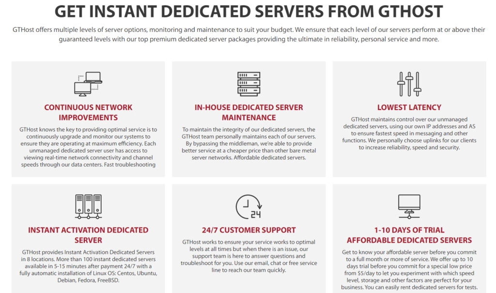
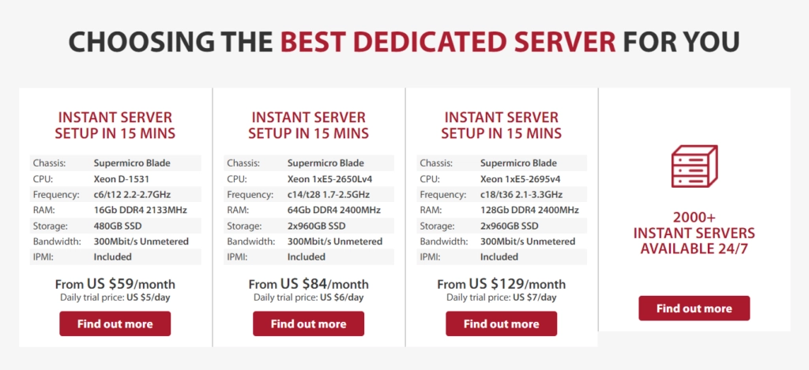

# Is GTHost's Instant Server Magic Actually Real? An Honest Look

You know that feeling when you need a server RIGHT NOW, but the traditional setup process makes you want to tear your hair out? You're sitting there, watching the clock tick, thinking "I could've built a rocket ship in this time." Well, GTHost claims their Instant Dedicated Servers solve exactly that problem. But here's the thing—everyone promises "instant" these days. Your pizza delivery says "instant." Your coffee maker says "instant." So what makes GTHost any different?

Let's cut through the marketing fluff and figure out if these servers are genuinely worth your time and money, or just another overhyped hosting option that sounds better on paper than in practice.

---

## What's This "Instant" Business Actually About?

Picture this: traditional dedicated servers are like ordering a custom-built car. You place your order, then you wait. And wait. Sometimes for days. GTHost's approach is more like walking into a dealership where the car's already sitting there with the keys in it—pre-configured, ready to roll the moment you sign the paperwork.

The whole thing works through automation. Instead of some poor tech manually setting up your server at 3 AM, the system does it automatically. Payment goes through, boom, server's live. It's not magic—it's just smart engineering.

## The Good Stuff (Because There's Plenty)

### Lightning-Fast Setup

Okay, this part actually lives up to the hype. Within minutes—not hours, not days, actual minutes—your server is running. For anyone who's ever launched something on a tight deadline, this is borderline miraculous. One user mentioned getting their e-commerce site up during a flash sale situation. Try doing that with traditional hosting.

### Won't Drain Your Bank Account

Look, dedicated servers aren't cheap. But GTHost manages to price these somewhere between "affordable" and "won't need a second mortgage." You're getting real dedicated resources without the enterprise-level price tag. Small businesses and startups seem to find this sweet spot particularly appealing.

### Actually Performs When It Matters

Here's where GTHost doesn't mess around—they've invested in solid hardware. Your site loads fast, stays up, and handles traffic spikes without melting down. Because what good is instant deployment if your server runs like a potato?

### Support That Actually Responds

24/7 support that actually answers. Not chatbots that make you want to scream into a pillow. Real humans who can help when something goes sideways at 2 AM on a Sunday. One reviewer specifically mentioned this saved them during a critical issue.

## The Not-So-Great Parts (Because Nothing's Perfect)

### Limited Tinkering Room

If you're the type who needs to customize every little setting, you might feel a bit boxed in. The pre-configured nature that makes deployment fast also means less room for deeply specific customizations. It's the trade-off for convenience.

### Pricing Can Get Confusing

The base prices look great, then you start adding features, and suddenly you're playing "how much does this actually cost?" It's not predatory or anything—just requires careful reading of the fine print.

### No Root Access for Control Freaks

GTHost's approach is more "managed hosting" than "here's the keys to everything." If you need full root access and complete control, this might not be your jam. They're aiming for people who want servers that just work, not people who want to rebuild everything from scratch.

### Geographic Limitations

👉 [Ready to deploy your server in seconds? See why developers are switching to GTHost's instant setup](https://cp.gthost.com/en/join/72c7e6b2fc118929f9ede2978f008806)

Data centers are primarily in North America and Europe. If your audience is mainly in Asia or other regions, you'll need to factor in that geographic limitation.

## What Real People Are Saying

JaneDoe123 has been running her e-commerce site on GTHost for over a year: "The speed was impressive, and the support team has been fantastic whenever I've needed assistance." She gave it 5 stars, which is basically the hosting equivalent of a standing ovation.

TechEnthusiast was slightly more measured: "I love the performance. My web applications run smoothly, and downtime has been minimal. However, I wish they offered more server customization options." Four stars—solid, with room for improvement.

Industry experts at HostingReviewPros summed it up nicely: "A great choice for businesses seeking balance between performance and affordability. The rapid deployment and reliable infrastructure make them stand out." Though they note users with highly specialized needs might need to look elsewhere.

## So, Worth It or Nah?

Here's the honest take: if you need a server that's ready yesterday, performs reliably, and doesn't require a degree in server management, GTHost's Instant Dedicated Servers deliver exactly what they promise. The instant deployment isn't just marketing—it's genuinely fast. The performance is solid. The support actually helps.

But they're not for everyone. If you need ultra-specific configurations, want full root access, or require servers in less common geographic locations, you'll probably feel constrained.

The real question isn't "are they worth the hype?" It's "are they right for YOUR situation?" For most small to medium businesses, startups, and developers who value their time over endless customization options, the answer is probably yes. 👉 [Experience the difference of instant deployment—join thousands who've simplified their hosting with GTHost](https://cp.gthost.com/en/join/72c7e6b2fc118929f9ede2978f008806).

---

## The Bottom Line

GTHost's Instant Dedicated Servers aren't revolutionary, but they don't need to be. They've taken something traditionally painful—server deployment—and made it simple. The combination of rapid setup, reliable performance, helpful support, and reasonable pricing hits that sweet spot most hosting solutions miss. Sure, there are trade-offs in customization and control, but for most users, the benefits far outweigh those limitations. If you've been putting off moving to dedicated hosting because the setup seemed too daunting, this might be exactly what finally gets you to pull the trigger.
